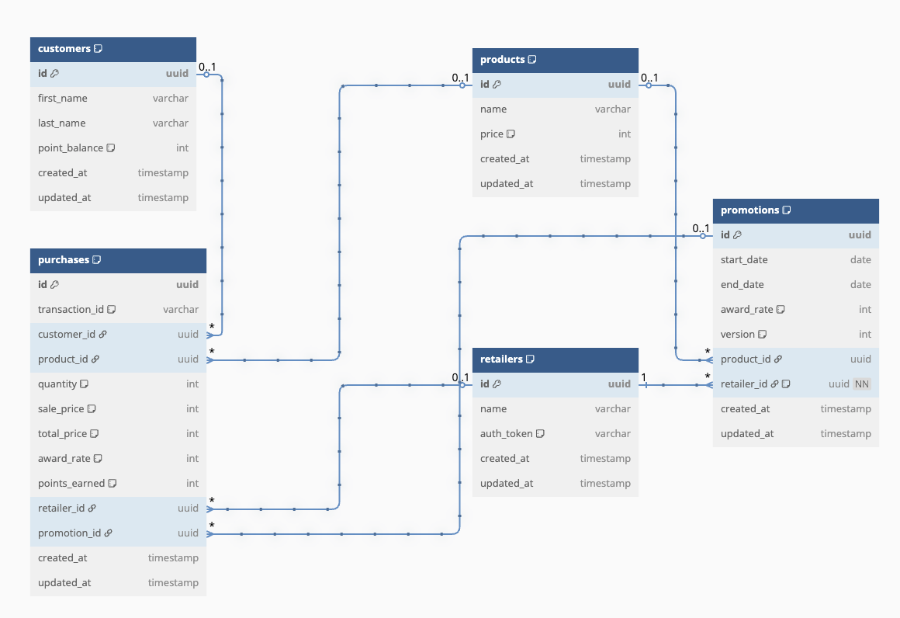

# Consumer Loyalty Backend

A demo NestJS application for testing API guild engineers during the hiring process. This backend application uses a PostgreSQL database via a local Docker setup. Candidates can pull the repo, spin up a database, start the app, and build out feature requests to observe their general computer skills, test development knowledge, and fitness for the role during a 1:1 in-person pair programming session.

## Business Challenge

To increase sales and popularity of our beer products, we would like to build out a consumer loyalty program where consumers earn points for their purchases of eligible products. This system tracks purchases at participating retailers nationwide, and credits customer accounts with points that they can later redeem for merchandise or other prizes. Data on customers, products, retailers, and promotions are managed by our company, but data about purchases comes directly from retailer point-of-sale systems via an API call to our consumer-loyalty-backend.

## Deliverables
When a customer purchases a promoted beer, the store's POS terminal sends a request to the backend. Your job is to implement:

1. GraphQL Purchase Mutation — Receives a purchase event and credits loyalty points if the product qualifies:
    - Customers receive points based on the award_rate of the current promotion per dollar spent on a qualifying product
    - Prevent double crediting if the same purchase is submitted twice
    - Update the customer's point balance atomically
    - Make as robust as possible--this is your chance to show your stuff

## Assumptions
- 1 product per purchase per retailer per customer
- All retailers carry all products
- Products and retailers won't change
- transaction_id is provided by POS system and is unique
- Millions of purchase requests could come in per hour, concurrently

## DB Schema

## 💡 NestJS Basics You Might Need
https://docs.nestjs.com/first-steps
 @Controller() for routing
 @Post(), @Get() to define endpoints
 @Body() to read request bodies
 @Injectable() service with depedency injection
 @Entity() + @PrimaryGeneratedColumn() for DB models
 @IsString(), @IsNotEmpty() for validation with class-validator

## 🧩 Optional Stretch Challenges
1. How would you support promotions based on retailer region?
1. What if the customer isn't found?
1. How would you handle duplicate transaction IDs across retailers?
1. How would you scale this API for 50k requests/sec across 10 regions?
1. Would you consider event ingestion instead of direct writes?
1. How would you monitor if points were being miscounted?
1. How would we account for different timezones?